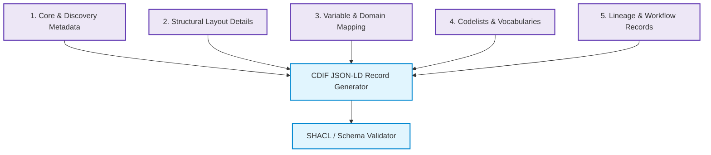

# Aligning with the Cross-Domain Interoperability Framework (CDIF): A Guide for Data Managers and Metadata Curators

The **Cross-Domain Interoperability Framework (CDIF)** is a coordinate standard developed under the CODATA Decadal Programme. It provides a set of metadata implementation recommendations designed to support the **F.A.I.R. (Findable, Accessible, Interoperable, Reusable)** data principles across domain boundaries. 

Rather than inventing a new metadata standard, CDIF profiles and constraints leverage existing, widely adopted metadata standards (including **schema.org, W3C DCAT, DDI-CDI, W3C SKOS, W3C PROV-O, and RO-Crate**) to make digital resources machine-actionable, discoverable, and easily integrated.

This document serves as an onboarding guide for **Data Managers** and **Metadata Curators** seeking to align their repositories, datasets, and vocabularies with the CDIF specification.

---

## 1. The Seven CDIF Profiles: At a Glance

CDIF is structured as a modular suite of profiles. Depending on your data type, access mechanisms, and organizational needs, you may align with some or all of these profiles.

| Profile Name | Conformance URI | Core Purpose | Target Domain / Use Cases |
| :--- | :--- | :--- | :--- |
| **1. Core Profile** | `https://w3id.org/cdif/core/1.0` | Establishes baseline dataset identity, access rights, and distribution endpoints. | All datasets and digital resources. |
| **2. Discovery Profile** | `https://w3id.org/cdif/discovery/1.0` | Adds granular spatial, temporal, and variable descriptions to make data findable. | Cross-domain cataloging, search indexes, spatial-temporal queries. |
| **3. Data Description Profile** | `https://w3id.org/cdif/data_description/1.0` | Details the internal structure of values, mapping physical columns to semantic variables. | Tabular files (CSVs), scientific data formats, statistical datasets. |
| **4. Data Structure Profile** | `https://w3id.org/cdif/data_structure/1.0` | Models structural layout types (Wide, Long, Dimensional, Key-Value) using DDI-CDI. | Advanced data integration pipelines, multidimensional data cubes. |
| **5. Codelist Profile** | `https://w3id.org/cdif/codelist/1.0` | Standardizes controlled vocabularies and taxonomies using bidirectional SKOS hierarchies. | Controlled vocabularies, classification schemes, code registries. |
| **6. Provenance Profile** | `https://w3id.org/cdif/provenance/1.0` | Tracks data lineage, acquisition methods, and step-by-step processing workflows. | Pipelled data, sensor networks, reproducible scientific workflows. |
| **7. Manifest Profile** | `https://w3id.org/cdif/manifest/1.0` | Standardizes flat packaging and serialization formats for data transport. | Data repositories (Zenodo, Dataverse), AI training sets (Croissant format). |

---

## 2. Why Align? Benefits of CDIF Compliance

Aligning with CDIF offers substantial benefits to data repositories, research networks, and archiving systems:

*   **Silo-Free Cross-Domain Discovery:** Historically, social sciences, health sciences, and environmental monitoring systems used incompatible metadata standards (e.g., DDI, HL7 FHIR, and ISO 19115). CDIF maps these domain-specific schemas into a unified, lightweight JSON-LD representation built on schema.org, allowing datasets from different origins to be indexed by global search engines and cross-domain catalogs simultaneously.
*   **Machine-Actionable Data Integration:** CDIF goes beyond typical descriptive cataloging. By specifying physical column-to-variable mappings and structural layouts (e.g., Wide vs. Long formats), data integration software can programmatically read, align, and merge datasets without human intervention or manual recoding.
*   **Ambiguity Resolution (Sentinel vs. Substantive Values):** CDIF prevents data corruption in automated pipelines by strictly separating *substantive values* (valid, meaningful measurements) from *sentinel values* (missing data flags, non-responses, or instrumentation errors). This ensures automated analytical tools do not compute sensor codes (like `-9999` or `999`) as actual physical measurements.
*   **Workflow Reproducibility & Auditing:** Curating provenance metadata using W3C PROV-O and RO-Crate models creates a clear chain of custody. Users can audit how the data was collected, what software or instruments were used, and exactly how the data was transformed.
*   **Semantic Consistency:** The Codelist profile ensures classification codes maintain their meaning over time and across systems by enforcing explicit, bidirectional hierarchies (`skos:broader` and `skos:narrower`), preventing semantic drifts when translating vocabularies.
*   **AI Readiness and LLM/Agentic Integration:** Aligning datasets with CDIF profiles—particularly utilizing formats like MLCommons Croissant—makes resources instantly ready for AI ingestion. The clean structure, unambiguous semantic definitions, and structured primary keys enable Large Language Models (LLMs) and autonomous AI coding agents to automatically query, parse, and analyze datasets without requiring manual custom-built pipeline setup.

---

## 3. Information Gathering Checklist for CDIF Compliance

To prepare your dataset or repository for CDIF alignment, curators must gather and organize specific metadata elements. Below is the operational checklist of information to assemble prior to generating CDIF-compliant JSON-LD records.

### Checklists by Curation Category

#### Category 1: Core & Discovery Metadata (Core & Discovery Profiles)
*   [ ] **Resource Identifiers:** Globally unique, resolvable IRIs/URIs for the dataset (e.g., DOI URLs, Handles) to populate `@id` and `schema:identifier`.
*   [ ] **Metadata Provenance:** Unique identifiers, modification timestamps, and maintainer information for the metadata catalog record itself (to populate the nested `dcat:CatalogRecord` under `schema:subjectOf`).
*   [ ] **Access & Rights:** A machine-readable license URL (e.g., Creative Commons URIs) or a URL pointing to explicit conditions of access.
*   [ ] **Access Methods:** The landing page URL OR direct file download URLs (`schema:DataDownload`) or API end-point protocols and restrictions (`schema:WebAPI` using OpenAPI specs).
*   [ ] **Spatial Bounds:** Coordinate bounding boxes or centroids mapped strictly in **decimal degrees under the WGS 84 datum** (e.g., `schema:spatialCoverage` -> `schema:geo`).
*   [ ] **Temporal Extents:** Calendar times represented as ISO 8601 strings. For non-calendar periods (e.g., geological eras, cyclical schedules), define the start and end boundaries using OWL-Time (`time:ProperInterval`).
*   [ ] **Dataset Citation Info:** Ordered creator lists (using ORCIDs for researchers and ROR IDs for organizations) and funding grants (with funding body IDs).

> [!WARNING]  
> **Coordinate Projection Errors:** CDIF validation will fail if spatial boundaries are expressed in local projections (e.g., UTM grid zones or EPSG codes). You must transform all geographic coordinates into decimal degrees on WGS 84 (EPSG:4326) prior to compliance checks.

#### Category 2: Structural Layout Details (Data Structure & Manifest Profiles)
*   [ ] **Dataset Physical Format:** The mime-types, character set (e.g., `UTF-8`), and total content sizes of all data distributions.
*   [ ] **Physical Layout Type:** Classification of the dataset's structural style:
    *   *Wide:* Rows represent observation units, columns represent distinct variables.
    *   *Long:* Rows stack variable names and values vertically (requiring identification of descriptor and value columns).
    *   *Dimensional:* Multidimensional arrays or data cubes (e.g., NetCDF, HDF5, SDMX).
    *   *Key-Value:* Schemas using key-value pair distributions.
*   [ ] **Delimited Text Constraints:** For tabular data (e.g., CSVs), confirm the column delimiter (comma, tab, semicolon) and whether a header row is present (mapping W3C CSVW parameters).
*   [ ] **Primary Keys:** Identify which column or ordered list of columns uniquely identify each row (to construct `cdif:hasPrimaryKey`).
*   [ ] **Packaging Organization:** Determine if files are served independently or zipped into archives. (Archive files require cataloging internal components using `schema:hasPart` referencing `schema:MediaObject` nodes).

#### Category 3: Variable & Value Domain Mapping (Data Description Profile)
*   [ ] **Column-to-Variable Mapping:** Map every raw column name or hierarchical array path back to its semantic variable definition. Note the 0-based index of each column.
*   [ ] **Physical Data Types:** Identify the physical type for each column (e.g., `float`, `integer`, `string`, `datetime`).
*   [ ] **Substantive Domains:** For numerical or measurement columns, define the valid, meaningful value ranges (minimum and maximum observed values) and the unit of measure (e.g., Celsius, meters).
*   [ ] **Sentinel Domains:** Document the specific codes representing missing values, refusals, or system errors (e.g., identifying `-9999` as "Instrument Failure", `-1` as "Refused to Answer", or empty strings as "Not Collected").
*   [ ] **Concept Associations:** Associate each variable with a conceptual definition in a standard vocabulary or registry (e.g., linking a column representing "Air Temperature" to a WMO concept URI).

> [!IMPORTANT]  
> **Sentinel Value Domain Separation:** Do not mix sentinel/missing codes into the general variable range. You must compile a distinct list of sentinel values and map them to their specific semantic reasons so pipelines can filter them automatically.

#### Category 4: Codelists & Controlled Vocabularies (Codelist Profile)
*   [ ] **Vocabulary Identity:** A unique, resolvable URI for the vocabulary container (`skos:ConceptScheme`) and its human-readable title.
*   [ ] **Term Listings:** Unique URIs, codes/notations, preferred human labels, and semantic definitions for each individual term in the vocabulary (`skos:Concept`).
*   [ ] **Hierarchical Relationships:** Map parent-child relationships in **both directions**:
    *   Identify which concepts are the root/top concepts.
    *   For every concept, specify its parent concept (`skos:broader`).
    *   For every parent, specify its child concepts (`skos:narrower`).

> [!TIP]  
> **Bidirectional SKOS Hierarchies:** Many vocabulary databases export code trees unidirectionally (only from child to parent). Before aligning with the Codelist profile, ensure you run processing scripts to generate the inverse links (`skos:narrower`), as CDIF SHACL rules strictly require bidirectional declarations.

#### Category 5: Lineage & Workflow Records (Provenance Profile)
*   [ ] **Upstream Source Datasets:** Identifiers and descriptions of all input datasets used to generate the current resource.
*   [ ] **Workflow Methodology:** Step-by-step descriptions of the processing pipeline (e.g., standard workflow scripts, computational step scripts, or Galaxy pipelines).
*   [ ] **Computational Tooling:** Specific software names, container versions (Docker/Singularity hashes), Github repository tags, or API versions used in each execution step.
*   [ ] **Processing Parameters:** Configuration variables, environmental settings, or command-line flags supplied during runtime.
*   [ ] **Agents & Roles:** Identifiers for the people or organizational units executing the process, along with their roles (e.g., "Creator", "Data Curator", "Validator").

---

## 4. Understanding CDIF Validation

Once the required information has been gathered and serialized into JSON-LD, compliance is verified through a two-step process:

1.  **JSON Schema Validation:** Ensures the structural syntax of the JSON-LD is correct (e.g., correct JSON keys, data types, and array formats).
2.  **SHACL (Shapes Constraint Language) Validation:** Evaluates semantic rules directly on the graph structure. SHACL checks confirm requirements such as:
    *   Declaring conformance to the correct profiles in the `dcat:CatalogRecord`.
    *   Ensuring spatial bounds are numeric decimal coordinates.
    *   Ensuring `RepresentedVariables` carry domain parameters rather than repeating them on individual instance variables.
    *   Verifying that `skos:Concept` hierarchies are perfectly bidirectional.

By using the checklists in this guide, metadata curators can preemptively clean and structure their information, ensuring a smooth path to CDIF conformance and true cross-domain interoperability.

---
