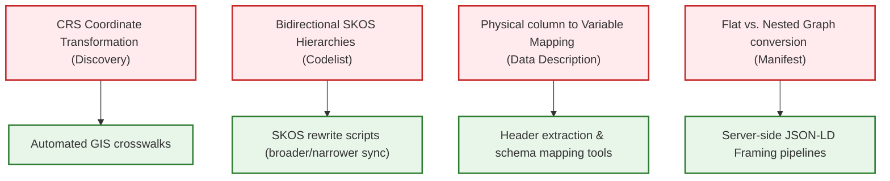

# CDIF Profile Compliance & Implementation Challenges Report

This report analyzes the compliance requirements, required elements, and practical implementation barriers across the Cross-Domain Interoperability Framework (CDIF) profiles: **Core, Discovery, Data Description, Data Structure, Codelist, Provenance, and Manifest (Packaging)**.

---

## 1. Compliance Architecture Overview

CDIF enforces compliance using a two-stage validation workflow:
1.  **JSON Schema Validation:** Structural validation (closed-world) verifying that required properties, array structures, and JSON keys are correctly structured. This requires JSON-LD framing to shape the RDF graph into a normalized tree before validation.
2.  **SHACL (Shapes Constraint Language) Validation:** Semantic validation (open-world) checking cross-node constraints, vocabulary checks, and conditional logic directly on the RDF graph.

---

## 2. Profile-by-Profile Compliance Analysis

### A. Core Profile
*   **Conformance Identifier:** `https://w3id.org/cdif/core/1.0`
*   **Core Required Elements:** `@id`, `@type` (must include `"Dataset"`), `schema:name` (meaningful title), `schema:identifier` (resolvable URI or `PropertyValue`), `schema:dateModified`, `schema:subjectOf` (CatalogRecord linkage), choice of rights (`license` or `conditionsOfAccess`), choice of download (`url` or `distribution`).

#### Practical Compliance Barriers & Challenges:
*   **Ambiguity in Metadata Provenance:** Separation of the metadata record itself from the resource it describes is achieved via a nested `dcat:CatalogRecord`. Legacy search indexing engines (like Google Dataset Search or standard catalogs) do not Monatively parse this nested structure and often conflate the catalog record's modification date (`schema:sdDatePublished`) with the dataset's modification date (`schema:dateModified`).

> ⚠️ **[REVIEW]** this approach solves the long standing ambiguity on what schema:dateModified actually qualifies. If a client doesn't parse the CatalogRecord, no information will be misinterpreted, but the update date for the metadata node would be lost. 

*   **Access Rights Structure:** Many repositories do not provide a machine-actionable license URI or formal access conditions, but instead provide long unstructured legal text blocks. Mapping these into a `LabeledLink` (`schema:CreativeWork`) requires manual curation or complex text extraction.

> ⚠️ **[REVIEW]**  If the repository only provides unstructured legal text, complex text extraction is going to be required, no matter where you put it in the JSON. In cdifCore this text would be inserted as text in the schema:conditionsOfAccess, not in a LabeledLink; the schema allows either option (or just an @id object reference to something).

---

### B. Discovery Profile
*   **Conformance Identifier:** `https://w3id.org/cdif/discovery/1.0`
*   **Discovery Required/Conditional Elements:** `schema:variableMeasured` (required for datasets), `schema:spatialCoverage` (required if geographically bounded), `schema:temporalCoverage` (required if temporally bounded).

#### Practical Compliance Barriers & Challenges:
*   **Geographic Coordinate Standardisation:** Spatial bounds must be defined in decimal degrees using the WGS 84 datum. Most legacy spatial metadata records (e.g. from ISO 19115 or local GIS databases) store extents in custom UTM zones, local projections, or named projections (e.g. EPSG codes), requiring coordinate transformation pipelines to pass validation.

> ⚠️ **[REVIEW]** "Most legacy spatial metadata records..." -- what's the evidence?  all the ISO19115 profiles I've worked on require WGS84 decimal degrees-- this is a requirement for interoperability (like speaking the same language).  Yes the data provider has to do a SRS conversion, but if they're using any modern GIS system, that's a trivial operation; metadata harvesters on the other hand are generally not equipped with SRS transformation capabilities.

*   **Temporal Extents (OWL Time):** Geologic time, cyclicity, or named ordinal eras must be mapped using `time:ProperInterval`. Representing geological boundaries (e.g. "Jurassic") in a machine-readable format that crosswalks cleanly with calendar time is a massive semantic challenge.

> ⚠️ **[REVIEW]**  the whole point is to enable temporal systems based on named ordinal eras for time positions that predate any calendar, and might not have known numeric temporal positions.  There are ordinal eras that overlap with calendars (e.g. 'reign of Henry VIII).

*   **Variable List Extraction:** Extracting conceptual variables out of raw data distributions (such as CSV file headers) to populate `schema:variableMeasured` is highly labor-intensive and lacks standard vocabulary mapping, leaving them as plain strings that fail advanced semantic queries.

> ⚠️ **[REVIEW]** The perfect is the enemy of the good....  Extracting column headers from text based tabular formats files is generally pretty easy; yes, we might just end up with an instance variable that has a label, and yes, sometimes people create tables with headers that are nonsense, but in general between inspecting the content of the columns in the table, and the label string provided, we can provide useful, if not perfect information that will have an obvious path for improvement.

---

### C. Data Description Profile
*   **Conformance Identifier:** `https://w3id.org/cdif/data_description/1.0`
*   **Data Description Required Elements:** `cdi:InstanceVariable` typing on variables, `cdif:physicalDataType` (array on variables, string on mappings), physical mapping (`cdif:hasPhysicalMapping` with `cdif:index` or `cdif:locator` and `cdif:formats_InstanceVariable` references).

#### Practical Compliance Barriers & Challenges:
*   **Physical Columns to Semantic Variables Mapping:** Physical column labels in raw files (e.g. `tmp_c_1`) must be explicitly mapped to semantic `InstanceVariable` definitions. If a dataset contains hundreds of abbreviated columns, creating these physical mapping nodes (`cdif:hasPhysicalMapping`) requires custom automated scripts.

> ⚠️ **[REVIEW]** I've not found this to be a problem that claude-code can't solve pretty quick.

*   **Value Domain Isolation:** CDIF requires separating substantive values from sentinel (missing/fill) codes (such as sensor `-9999` fill values or survey refusal codes) using `cdif:SubstantiveValueDomain` and `cdif:SentinelValueDomain`. Standard repository exports typically intermingle these inside data columns, requiring manual dataset inspection to extract and structure them.

> ⚠️ **[REVIEW]**  I agree-- this is an important point; we need a simpler way to represent value enumerations that include both sentinel and substantive values. See [value domains-- sentinel values should be indicated by a 'type'
 ](https://github.com/Cross-Domain-Interoperability-Framework/profile-datadescription/issues/1)

*   **Primary Key Modeling:** Multi-column keys require assembling `cdif:hasPrimaryKey` with ordered `cdi:ComponentPosition` nodes. Traditional repository metadata (such as Dataverse or Zenodo) does not export primary key constraints, necessitating custom post-processing to derive them.

> ⚠️ **[REVIEW]**  that is probably the case, but how often do we have to deal with multi-column keys. In the examples I've worked with so far, I havn't even found a primary key definition...  the IdentifierComponent usually fills the role. 

---

### D. Data Structure Profile
*   **Conformance Identifier:** `https://w3id.org/cdif/data_structure/1.0`
*   **Data Structure Required Elements:** `cdi:isStructuredBy` pointing to `cdi:DataStructure` on distributions, subtyped layout classes (Wide, Long, Dimensional, Key-Value), and reusable represented variables (`cdi:RepresentedVariable`).

#### Practical Compliance Barriers & Challenges:
*   **Modeling Complexity for Long Layouts:** Long-format datasets (where variable names and values are stacked in rows) require matching `cdi:VariableDescriptorComponent` to `cdi:VariableValueComponent`. This is a highly abstract structural modeling paradigm that standard developers struggle to implement correctly.

> ⚠️ **[REVIEW]** I don't doubt it! Is there a better way?

*   **Deep JSON-LD Nesting:** By lifting value domains and units to `cdi:RepresentedVariable` and linking them via `cdif:uses`, the JSON-LD document becomes deeply nested and extremely difficult to inspect or author manually.

> ⚠️ **[REVIEW]** that's only required if one is creating a standAlone structure definition, and yes that reusability generates complexity. Fortunately, there shouldn't be much (if any) manual editing of this kind of metadata.

---

### E. Codelist Profile
*   **Conformance Identifier:** `https://w3id.org/cdif/codelist/1.0`
*   **Codelist Required Elements:** `skos:ConceptScheme` defining the vocabulary, and `skos:Concept` defining terms. Must provide preferred labels and definitions.

#### Practical Compliance Barriers & Challenges:
*   **Strict Bidirectional Hierarchy:** CDIF mandates that all hierarchical relationships be defined in both directions: parent concepts must link to children via `skos:narrower`, and child concepts must link back via `skos:broader`. Standard vocabulary management systems (like PoolParty, VocBench, or Protégé) often export hierarchies unidirectionally, causing exported codelists to fail CDIF SHACL rules.

> ⚠️ **[REVIEW]** A topic for discussion.  In order to only use skos:broader, in JSON-LD the vocabulary has to be represented a graph, with a node for each concept.  To generate a JSON-compatible (hierarchical, nested) representation, you have to go from conceptScheme-->topConcept-->narrower-->other concept.   We were given the requirement that skos:broader relations are required if the vocab is hierarchical.  The ramification is that both broader and narrower are required.   Fortunately its a pretty easy sparql insert to get both relations in. 

*   **Handling Array Exceptions:** Because Codelists do not enforce strict array wrapping for repeatables (to comply with standard SKOS serialization), client parsing software must write custom conditional checks to handle both single string values and arrays.

> ⚠️ **[REVIEW]**  Interesting, I wasn't aware strict array wrapping for repeatables is standard SKOS serialization; the schema I looked at allow string or array values. In the other CDIF schema we do require  array wrapping for repeatables.  ?should we revise the schema?

---

### F. Provenance Profile
*   **Conformance Identifier:** `https://w3id.org/cdif/provenance/1.0`
*   **Provenance Required Elements:** `prov:Activity` subtyped as `schema:Action`, `prov:used` (inputs), `prov:wasAssociatedWith` (performers), `prov:Entity` subtyped as `schema:Dataset`, and `prov:wasGeneratedBy`.

#### Practical Compliance Barriers & Challenges:
*   **Workflow Granularity Bloat:** Pipeline tools (such as Snakemake, Nextflow, or Galaxy) produce highly granular execution logs. Converting every command step into a `prov:Activity` linked by `prov:wasInformedBy` results in massive metadata files that can overwhelm search indexers.
*   **Actor Identification:** Automated processing runs are typically executed by system accounts, service workers, or virtual nodes rather than individuals. Mapping these to valid schema.org `Person` or `Organization` nodes with unique identifiers (like ROR or ORCID) is often impossible without inventing dummy records.

> ⚠️ **[REVIEW]**  noted. this prov profile is a draft, not part of the release packages.

---

### G. Manifest (Packaging) Profile
*   **Conformance Identifier:** `https://w3id.org/cdif/manifest/1.0`
*   **Manifest Required Elements:** Flat `@graph` structure in RO-Crate, metadata descriptor `ro-crate-metadata.json`, root dataset remapped to `"./"`.

#### Practical Compliance Barriers & Challenges:
*   **Translation Overhead:** Converting between nested trees (normal CDIF) and flat graphs (RO-Crate) requires running JSON-LD framing and flattening algorithms. This adds processing overhead and requires heavy software libraries (like PyLD) which cannot be run in lightweight, browser-based, or static environments.

> ⚠️ **[REVIEW]** yes, so?  Why does RO-Crates require the flattened format?

*   **Archive Distribution Scaling:** Mapping deep folder paths inside a zip archive using `hasPart` containing MediaObjects does not scale well. For datasets containing thousands of individual component files, the manifest file itself can become larger than the actual data.

> ⚠️ **[REVIEW]** Good point.  the Crossaint approach using slug names for file patters is the solution, just haven't plugged it in yet.  (when there are thousands of component files, like the XCT data in astromat, the file names are patterned, so the slugs work)

---

## 3. Summary of Compliance Challenges

### Recommendations to Mitigate Compliance Barriers:
1.  **Automated Mapping Tooling:** Develop standard post-processing utilities (similar to `ddi_to_cdif.py` or `dcat_to_cdif.py` in the validation repository) to automate coordinate transformations, SKOS bidirectional additions, and CSV header extraction.
2.  **Middle-Tier Framing Services:** Use server-side framing pipelines (e.g. using `FrameAndValidate.py`) to shield metadata authors from structural nesting constraints, allowing them to author flat metadata that is framed automatically before schema validation.
