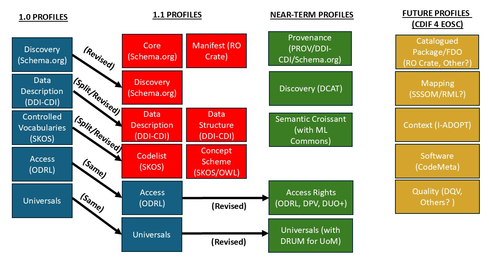

# Development, Production, Dissemination, and Maintenance 

## Background

The goal of this section is to provide a brief overview of how the Cross-Domain Interoperability Framework (CDIF) will be developed, produced, disseminated, and maintained into the future, starting with Version 1.1.  The first version of the guidelines was produced as an output of the WorldFAIR project, and has undergone further development and maintenance under the WorldFAIR+ project, leading to the new release, Version 1.1. It is expected that several ongoing projects such as CDIF 4 XAS, CLIMATE ADAPT 4 EOSC, and especially CDIF 4 EOSC will drive significant further developments. Consequently, an attempt is made to establish a stable framework within which these developments can be managed.

CDIF has identified many different aspects of FAIR-supporting systems in cross-domain scenarios which will benefit from agreements about the metadata to be exchanged. These are termed "FAIR functions," and include such things as cataloguing, search, and discovery; description of data sets; description of access to and licensing of resources; description of data provenance; data packaging; data transformations and mappings; description of controlled vocabularies and code lists; and so on. The list is a long one. 

In each of these areas there are existing standards, and typically more than one, with many being domain-specific and not used or useful outside their intended domain scope. CDIF identifies agreed standards - and agreed, limited implementation of those standards - so that the core information needed to support any particular FAIR function will always be understood by the counterparties involved. Thus, it is a growing lingua franca for use of FAIR resources across domains and infrastructures which otherwise would not use the same standards. 

CDIF has taken a pragmatic approach, prioritizing what it sees as the most important functions, and those which can most readily be adopted: profiles have been created for discovery, data description, code lists, and basic access, along with conventions in the important areas termed "universals": time, geography, and units of measure. For each, a set of recommendations has been made. To summarize these, a set of core metadata fields has been identified, along with a mechanism for their expression and publication on the Web. Metadata is expressed in the form of JSON-LD, a syntax which is commonly used on the Web, but which marries developer familiarity with the richness of RDF.

This paper briefly describes the processes for development, production, dissemination, and maintenance of CDIF. Several new profiles will be added to Version 1.1, and a much large number in subsequent releases. Each new function is supported in its own "profile," a set of technical and documentary resources which enable developers to implement interoperable sets of metadata for each specific function. These profiles are the items which are developed and produced for use.

Note that the development, production, and maintenance processes are coordinated by the CDIF Editorial Team, drawing on the expertise of other members of the CDIF WG. (Note that this document does not address the governance or organization of CDIF.)

The CDIF Book  and the CDIF.org website are good places to find the latest information regarding what profiles are currently available, which are under development, and which are planned. This is also where information regarding the CDIF Working Group and CDIF Advisory Group may be found.

## Development of CDIF Profiles

CDIF is developed by teams of experts who are typically volunteers or project participants with an interest in the existence of CDIF because of the interoperability it will enable. Research is increasingly data-intensive and cross-domain in orientation, making the need for something like CDIF increasingly urgent. Many volunteers are involved with the development of other technical standards and specifications in areas related to FAIR use of resources. 

These individuals are brought together by CODATA as the coordinating body, providing the expertise and work force for the development of CDIF. They are organized into two groups: the CDIF Working group and the CDIF Advisory Group. The Working Group performs most of the development, with the Advisory group in a steering and review capacity.

When a new profile has been identified for development, a series of meetings are held, going through several steps:
1. Landscape review: Identification of the current state of play, scope, and requirements.
2. Narrative: Creation of a description of the purpose of the profile - how it will be used, what problems it will solve, and what business functions it will support.
3. Conceptual model: A syntax-independent modelling of the information needed for the profile, bearing in mind existing system capabilities and information holdings.
4. Implementations and examples: The use of one (or, if needed, more than one) common standard(s) for the implementation of the identified information, and creation of syntax examples based on real use cases. This both tests earlier steps and illustrates the solution to be recommended.
5. Hand-off to production: This stage involves working with the production team to make sure that the profile is formally modelled as intended in UML, and that the outputs created contain the needed information. Input in the form of specific documentation is critical so that the intention of the developers is communicated to end users effectively. 

### Development platform
Github will be the development platform, using the [https://github.com/Cross-Domain-Interoperability-Framework](https://github.com/Cross-Domain-Interoperability-Framework) organization.  There are separate repositories for each profile. 

Development work should be organized in the main branch of a repository. Work should generally start by creating an issue describing planned contribution, and then creating a branch with the issue number in the branch name.  When the contribution is ready, create a pull request to merge the branch into the main branch. When the pull request is merged, the issue can be closed, and the branch deleted (it will still be in the GitHub history). If a contributor does not have permission to create a branch in the repository, they should create a fork to host their work.  

### Identifiers for CDIF resources

URIs will be resolved using the w3id redirect service ([https://github.com/perma-id/w3id.org#permanent-identifiers-for-the-web](https://github.com/perma-id/w3id.org#permanent-identifiers-for-the-web)).  Many of these will redirect to released in GithHub. Artifacts that are not managed via github can be published on cdif.codata.org with w3id redirects to those locations.   New releases will require updating the .htaccess files at [https://github.com/perma-id/w3id.org](https://github.com/perma-id/w3id.org). 

## Production of CDIF Profiles

For the existing CDIF profiles, all of the various artefacts (documentation, SHACL validation, JSON Schemas, examples) have been created by hand. Up until now, ythere has not been a consistent set of artefacts for the profiles, but an evolving one. A standard set of artefacts has been identified as a result of several different projects and implementations, so that there will be a consistent in version 1.1 and beyond. This will include:
1. High-level documentation describing the purpose of the profile, and describing the Conceptual Model as a set of information requirements
2. Field-level documentation for each recommended syntax implementation, provided in the form of a normative document.
3. SHACL for validating the profile
4. JSON Schema for validating the profile
5. JSON-LD examples
6. JSON-LD Framing for the profile
7. Clickable Field-Level documentation, linking all of the syntax artefacts (SHACL, JSON Schema, etc.) together with detailed documentation for developers
8. A UML formalization of the profile implementation, expressed as Canonical XMI, and according to the UCMIS style to ensure interoperability across UML tools
9. Potential/Future: Pydantic classes to enable easier Python implementation
10. Potential/Future: OGC Building Blocks to enable easier domain-level adaptation and specification

The production flow in future will start with the creation of the UML model for each profile implementation, working with the development team on the basis of the Conceptual Model and the syntax implementation and examples. Once the production team has developed a suitable UML model, this will be used to drive the coordinated generation of all of the other artefacts.
It is worth describing why the UML: model is used in this way. It is often the case that UML is employed to define a conceptual formalization. That is not the case here. RDF vocabularies are often modelled in a fashion which does not fit neatly into the object-oriented style of UML formalizations, so the more generic style used in the RDF community is employed here (essentially, "boxes and arrows" based on the RDF information model, as often seen in W3C Recommendations). The CDOIF Conceptual Model for each profile is documented, but is not formalized as a UML model. 

The UML formalization is not a single implementation model, but a somewhat generalized one, as it must span implementation in a set of different syntax-bound outputs: SHACL, JSON Schema, OO classes like Pydantic, etc. All of these artefacts must be coordinated, or the profiles will not function as intended. (E.g., a JSON-LD metadata instance must be valid according to both the JSON Schema and the SHACL rules, etc.)

Given the number of profiles anticipated, as shown in the diagram below, it is essential that the artefacts themselves are generated from a single source of truth, so that they remain consistent without the risk of manual error.
  
While the UML model for each profile may be useful to implementers, and will be made available to them in an XMI format for reuse, it is primarily a part of the CDIF production system, and should be considered as such. It is not itself a deliverable for direct use, unlike other artefacts (such as SHACL rules, JSON Schema, Pydantic classes, etc.)

## Dissemination, Maintenance, and Versioning of CDIF Profiles

Once all the different artefacts for a profile have been produced, and have gone through the approval process, they will be published in the CDIF Book as part of a versioned release. Each profile implementation will have a date assigned to it, indicating when it was last updated. This mechanism will be used to track minor changes, such as documentation edits,  and additions (as for new types of artefacts), but will not be indicative of major changes to the recommendations themselves. Major changes will be part of larger, numbered  releases (as we see from Version 1.0 to Version 1.1). 

All of the CDIF artefacts are stored in the appropriate GitHub repositories. In the case of explanatory text, this may be in the form of the Markdown which is used to populate the CDIF Book. Other non-narrative forms of documentation (field-level documentation, JSON Schemas and examples, SHACL rules, etc.) will be managed in a related production repository, which will also serve as the basis for the technical distributions.

GitHub issues and pull requests will be used as the basis for a regular process of reporting bugs and requesting features in existing profiles. (This process is documented separately.) The CDIF Editorial Team is responsible for performing this maintenance on a technical level.
