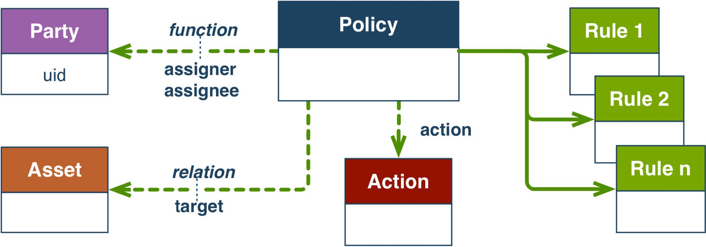

# Overview of ODRL

The core classes are:
- **Parties** - actors or agents who exercise:
- **Rules** - ODRL Permissions (can do), ODRL Duties (must do), ODRL Prohibitions (must not do)
encompassing:
- **Actions** - operations performed on:
- **Assets** - digital objects in a CDIF context.
- **Policies** - are structured artefacts that document the above information.

Figure. Simplified schematic of main ODRL Classes.

## ODRL resources

ODRL Information Model: https://www.w3.org/TR/odrl-model/

ODRL Core Vocabulary: https://www.w3.org/TR/odrl-vocab/

Example ODRL access policies:
https://fiware-true-connector.readthedocs.io/en/latest/usage_control_rules.html

Arxiv preprint on applying ODRL in Transport Mobility Data Space: https://arxiv.org/pdf/2309.11289.pdf

ODRL Policy validator: https://odrlapi.appspot.com/