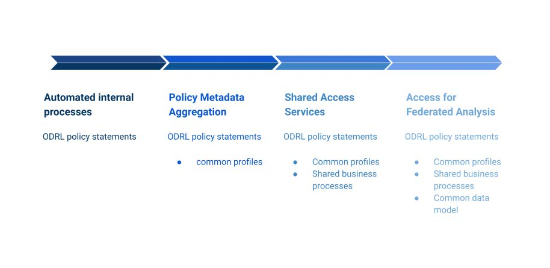

# Data access policies

## Data provider vs. data user access policies
ODRL data access policies can be formulated or executed by either the data provider or the data user. For example, a data user may establish an ODRL policy that requires the data to conform to a certain standard as part of a machine readable request. Because of the audience and context of CDIF, this document starts from the perspective of the data policies of the data provider, since they fit in with the perspective of a metadata standard for interoperability being established for/by data providers.

## Access classifications
It is not uncommon for data providers (or communities thereof) to apply broad 'access classifications' to data, for example:
● openAccess / restrictedAccess [CESSDA](https://www.cessda.eu/)
● Open / Safeguarded / Controlled [UKDS](https://ukdataservice.ac.uk/)
● ClosedAccess / EmbargoedAccess / RestrictedAccess / OpenAccess [OpenAIRE](https://www.openaire.eu/)

When included in discovery metadata, such classifications drive useful functionality in portals or catalogues for filtering or faceting search results. They are not sufficient however to drive automatable access processes. Machine-actionable access policies are inherently more fine grained than such high level classifications and involve a number of top level entities (parties/actions/rules) over sequenced workflows (request/access/usage). It would not be practical to create a top-down classification system granular enough and with broad enough consensus to drive machine actionable access policies. Rather the recommendation here is to use a standardised and structured language for access policies so that these can be generated bottom-up and yet retain the appropriate level of interoperability.

## Access policy scenarios and recommendations
This section discusses several situations dealing with sensitive data for with access policies are necessary.
1. A standalone repository holding sensitive personal data wishes to provide 'secondary access' to other research groups. [Standalone repository](./odrlinternalpolicies.md)
2. A metadata aggregator wants to provide search clients with filters based on access policies [Metadata aggregator](./odrlaggregateaccessconditions.md)
3. A central clearing house mediating access to data in federated repositories [Mediated access](./odrlsharedservices.md)
4. Federated analysis over multiple sensitive data providers [Federated analytics](odrlfederatedanalysis.md)

These scenarios build a set of typical requirements for the interoperability of access policy summarised in the figure below.

Figure. Data access scenarios

