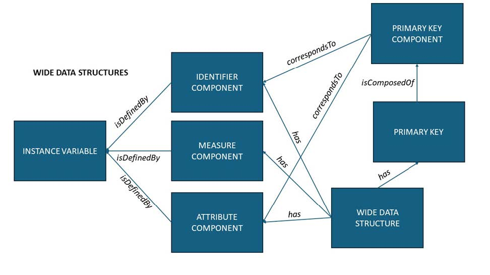
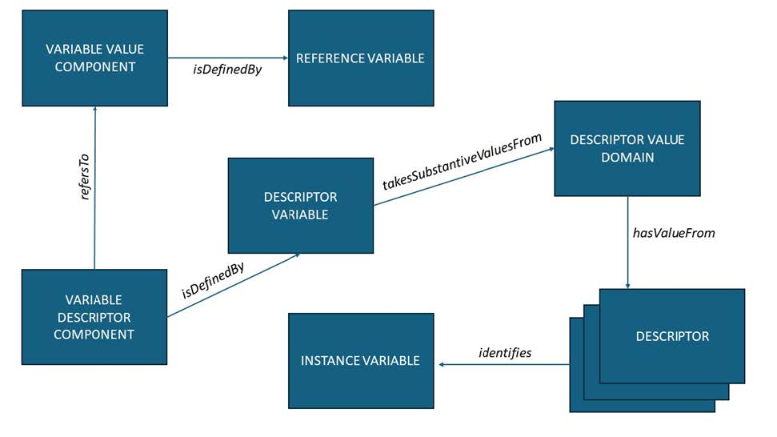
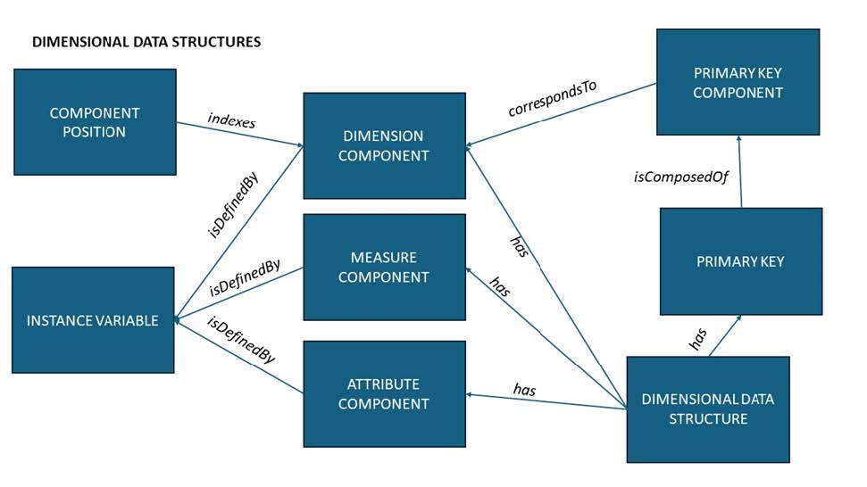
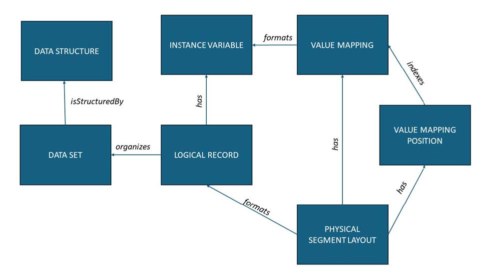

# DDI-CDI description of Data Structure 
A Data Set has a fixed structure. A data set might be the result of querying services, with the Data Structure generated when the query is executed along with the resulting data. There are three types of Data Set: Wide, Long, and Dimensional. The descriptions of these are very similar, differing mainly in the way they identify specific data cells. Variables are described separately from the Data Structure, because variables can be re-used across different structures. For instance, a ‘Nation’ variable represented with a two-character ISO Country Code might be reused across several different data sets, for example SDG Indicators and the Minimum Set of Gender Indicators. 

The role of a variable within a specific Data Structure is represented by the cdi:Component class. There are several specific types of Components: identifiers, measures, attributes, and so on. These are described as appropriate for each of the three types of data structure. A Component is the specific role played by a variable in the context of a data structure. Each Component appearing in a Data Structure is specific to that Data Structure, and should have its own identity. The variables are the reusable form of the information that can be used across different structures.

## Wide Data Structures

Most data sets can be described as Wide Data Sets in DDI-CDI – these are those cases where each row in a tabular view of the data is a record, and each column is a single variable. To describe a Wide Data Structure, each variable (here we use Instance Variables, acting in their capacity as Represented Variables) is assigned as defining a specific type of Component. In Wide Data Structures, the only Component classes we need are Identifier Components (cdi:IdentifierComponent), Measure Components (cdi:MeasureComponent), and Attribute Components (cdi:AttributeComponent). The diagram below shows how these and other classes are related.



Figure. Wide data structures.

Measure Components hold the observed or measured values in our data. Identifier Components hold specific identifiers assigned to the cases in our data: each record is about a single ‘case’, and these are sometimes assigned identifiers to distinguish them. As in the example provided below, this could be a tax-payer ID for a person, for example, or might be a randomly assigned number in the case where the cases have been anonymised to protect their identities.

```{image} ./figures/widedataexample.jpg
:alt: Long data structure
:class: bg-primary mb-1
:width: 300px
:align: center
```
Figure. Example wide data. TaxpayerID is an identifier component, Taxes Paid is the measure component, and Year is an attribute component.
<br>

It is sometimes the case that an identifier Component is sufficient to disambiguate all the records in the data set: Identifier indicating the row/case, and the variable telling you which value in that record. Often, however, there will be additional fields which are needed (like a timestamp, if the same case was measured/observed on more than one occasion). Attribute Components contain additional information about the measurements/observations which are applicable to each case. Typical Attribute Components are time stamps, geographical coordinates, statuses, or other data related to the context of the measurement or observation. The Primary Key is the set of Components needed to uniquely identify each record in the data set. It is not typically the case that the Measure Components form part of the Primary Key.

## Long Data Structures
If a Measure Component in a data set cannot be clearly associated with a single variable, but relies on the value of another variable to indicate which variable it measures, then you have a Long Data Set, and not a Wide one.   Long Data Sets use additional Components, as they have a more complex relationship to logical variables. An example is useful illustrate the difference between Wide and Long Data Sets. 

```{image} ./figures/longdatasetexample.jpg
:alt: Long data structure
:class: bg-primary mb-1
:width: 400px
:align: center
```
Figure. Long dataset example.
<br>

To describe a Long Data Structure define the logical variables so that each variable has a clear definition, containing a single type of measurement. In this example, the logical variables are Patient ID, Pulse, Weight, Temperature.  These become Instance Variables in the metadata.   The actual columns in the table are considered Presentational Variables, these are Test, Reading, and UoM. 

 In the example table above, the presentation consists of an Identifier Component (*Patient ID*), a column giving us the test performed (*Test*), a column with a measurement (*Reading*), and a column with a unit of measure for the reading (*UoM*). The *UoM* column is an Attribute Component: each entry provides a value that represents a Unit of Measure, and we can easily describe a 'Unit of Measure' variable. The *Reading* column is more problematic: each cell contains a measurement, but they are different types of measures. In order to understand the measurement, you have to consult the *Test* column, which tells you whether it is a pulse, a temperature, or a weight. *This dependency is the characteristic feature of Long Data Sets*.

*Test* is a Descriptor Variable (cdi:DescriptorVariable), and *Reading* becomes a Reference Variable (cdi:ReferenceVariable). A Reference Variable can present measurement values from several logical Instance Variables. The Descriptor and Reference variables together are refered to as a Variable Descriptor Component (cdi:VariableDescriptorComponent) defined by a Descriptor Variable (*Test*), and a Variable Value Component (cdi:VariableValueComponent), which is defined by a Reference Variable (*Reading*).

The resulting metadata will have descriptions of both the logical (*Patient ID*, Pulse, Weight, Temperature) and presentational (*Test*, *Reading*, *UoM*) variables. The Components in my Long Data Structure would reference the presented variables: *Patient ID* (an Identifier Component), *Test* (a VariableDescriptorComponent), and *Reading* (a VariableValueComponent) but the logical variables in turn would all be referenced from the VariableDescriptorComponent and associated classes, as described below.

VariableDescriptorComponents have a refersTo association with a VariableValueComponent; in this example, *Test* will associate itself with *Reading* in this way.

Descriptor Variables will always take their values from a Descriptor Value Domain (cdi:DescriptorValueDomain). This domain is a set of codes that identify logical Instance Variables. The code in the Descriptor Component indicates which Instance Variable the value provided in the corresponding Reference Variable should be associated with. Thus, in our example above, when the *Test* column has a value of 'Temp', we know that the value in the *Reading* field is a measurement of temperature, associated with the temperature logical variable.

The Primary key in a long data structure is assembled from the presentational variables. In the example above, it is a compound key consisting of *Patient ID* and *Test*.

A Reference Variable has a range that includes all possible values of the variables for which it can hold measures. Thus, Reference Variables are often declared as generic types such as XSD string. The specific types of any value can be determined from the description of the associated Instance Variable (the logical variable) specified by the Descriptor Variable.  Figure 17 shows how these presentational classes are connected.


Figure. Long data structures - presentational elements.
<br>

The point of having this additional structural metadata for a Long Data Structure is that by providing logical Instance Variables, we are able to reassemble the values in the data set according to other structural arrangements (typically Wide or Dimensional), and to do so programmatically. Although we could have described the example table as a Wide Data Set, the actual variables in the data could not then be re-arranged or re-used: they would be specific to the structure of the data set they appeared in.

## Dimensional Data Structures

A dimensional data structure can be thought of as a multidimensional array, in which each cell in the array contains a measure value. The axes of the array are indexed by Dimension Components. In a Dimensional Data Structure the Primary Key is made up of Dimension Components. Taken together, these address an individual cell with the multidimensional data array, commonly refered to as a cube. That cell holds a value of the Measure Component. Attribute Components are associated with the Measures at the cell level, not at the level of an entire record. The diagram below shows the set of classes which are needed.



Figure. Multidimensional data structure.
<br>

The exception to this is if a ‘cell’ has more than one Measure Component, in which case the set of Measure Components requires further disambiguation. This can be specified by qualifying the Primary Key values with the Measure Component/Variable. It is recommended that only a single Measure Component be used;  cells should, if possible, hold simple values such as a string/code, a date-time, or a number. In some cases — notably in the DataCube Vocabulary from W3C and the SDMX specifications on which it is based — the dimensions in a key are ordered. In DDI-CDI, specifying an order is done using the Component Position (cdi:ComponentPosition) class. 

```{image} ./figures/datacubeexample.jpg
:alt: Long data structure
:class: bg-primary mb-1
:width: 400px
:align: center
```
Figure. Example Dimensional Data: Education Level of Belgian Residents
<br>
The table above provides a simple example of a Dimensional Data Set, and how its structure can be described. In this example, the first four columns act as dimensions for addressing the value given in the last column. There would be five Instance Variables described: Year, Degree, Province, Age, and Percent. The representations of these variables would be enumerated using SKOS Concept Schemes except for Year, which would be an XSD gYear, and the Percent variable, which would have a numeric type. Year, Degree, Province, and Age would all be used to define Dimension Components, which could be indexed using instances of the Component Position class, assigning them a ranking from 1 to 4 (ordered low-to-high). Taken together, these four Dimension Components would form the Primary Key. Percent would be a Measure Component. 

# Describe the physical format of the data

In this initial version of CDIF, we are only describing data that is expressed in a textual format such as a CSV file, fixed-width tabular files, or the query result from a relational system. (This is a limitation which will be addressed moving forward.) Further, the assumption is made that any Data Set uses only one structure for all of its records, and that these are organised in a uniform way. These recommendations pertain to data that can be represented in a tabular data structure, packaged in datasets that consist of a set of records that all have the same set of fields. The figure below shows the classes needed for describing the physical encoding of the data.


Figure. Describing physical layouts.

The Logical Record (cdi:LogicalRecord) references all of the Instance variables used within the Data Set. A Physical Segment Layout (cdi:PhysicalSegementLayout) describes the way in which that Logical Record is expressed in the physical file. It has a set of Value Mappings (cdi:valueMapping) instances and corresponding Value Mapping Position (cdi:ValueMappingPosition) instances, which provide the links between the physical layout and the values of the Instance Variables. Physical Segment Layout instances contain much of the information needed by machines to read the data (i.e., character encodings, delimiters, line-end characters, etc.). Note that the formats relationship between Value Mapping and Instance Variable has been collapsed from what is presented in the DDI-CDI model by omitting the intervening Data Point, as Data Points are not instantiated in this profile.
