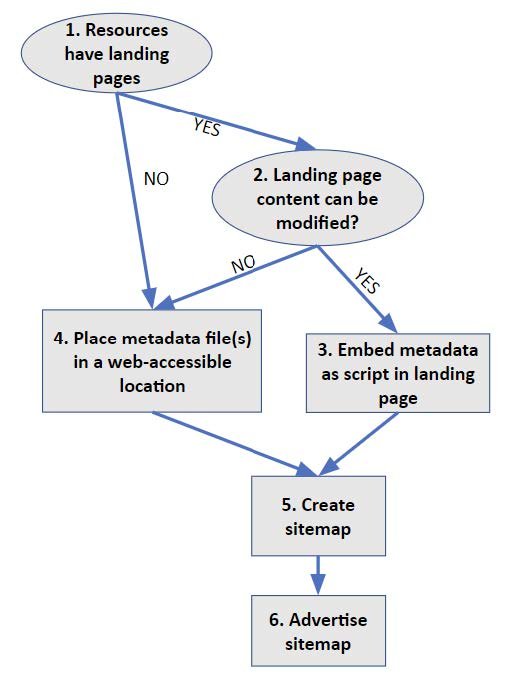
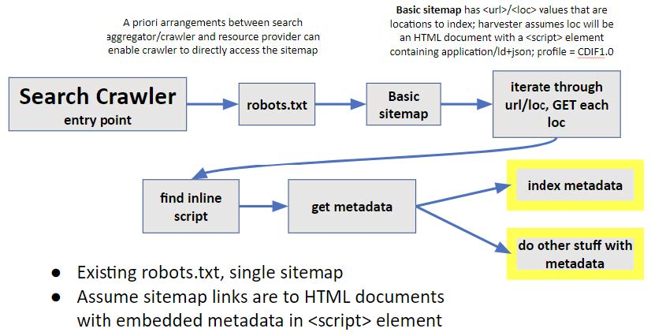
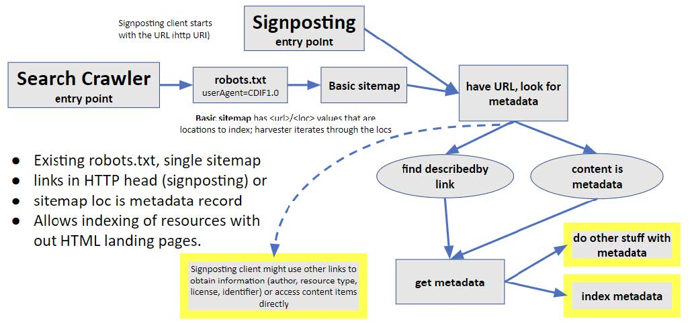

# Metadata publication

This section describes workflows recommended for a metadata publisher to make their metadata accessible to Web crawlers for search engines to index their resources. The figure below is a flow chart showing the decision tree to determine how to expose metadata. Numbers in the following discussion refer to numbered boxes in the diagram.

Figure. Decision graph to determine where metadata is located, from the resource publisher's perspective. Steps are numbers and referenced in text.

## Option 1. Embedded in HTML
Starting at the top (1) in the above figure, if there are HTML landing pages that describe the resources of interest, and the metadata publisher has the necessary authority to update the content of these pages, then CDIF metadata serialised as JSON-LD (see Appendix 1) should be embedded in an HTML <script> element in the &lt;head&gt> section of each landing page (3). The script should have the following type and profile attributes: 

type="application/ld+json" profile="CDIF1.0"

## Option 2. Individual metadata file URLs
If the resources of interest do not have individual landing pages, or the metadata publisher does not have authority to update the content of landing pages, the metadata should be placed in a Web-accessible location (step 4 in the figure above). There are two common approaches:
- Each metadata record is accessed in a separate, static file with its own URL. The CDIF metadata is serialised as JSON-LD (see [Schema.org implementation](./schemaorgimplementation.md) ). MIME type for the metadata file, returned as the Content-Type parameter in the HTTP response header, is:

type="application/ld+json" profile="CDIF1.0"

- Each metadata record is accessed dynamically from the server using a URL. There are various open-source metadata server systems that can be configured to deliver CDIF metadata from the server's metadata database, e.g. [GeoNetwork OpenSource](https://geonetwork-opensource.org/), [GeoPortal](https://github.com/Esri/geoportal-server-catalog), [CKAN](https://ckan.org/). The metadata retrieval URLs have different syntax depending on the software used, but typically include a metadata record identifier and a format parameter that would be used to indicate that CDIF metadata should be returned. If there is a format parameter in URL requests, its value should be '**CDIF1.0**'.

## Option 3. Metadata list file
- A collection of metadata records is gathered in one file accessed using a single URL. For CDIF, this file should contain a set of CDIF JSON-LD metadata objects, implemented as a schema.org [ItemList](https://schema.org/ItemList). See example in Appendix 1. The MIME type for the collection is:

*type="application/ld+json" profile="CDIF-list-1.0"*

# Find metadata
CDIF recommends the use of sitemaps to address the questions of how crawlers find metadata to index or use. A [sitemap](https://www.sitemaps.org/protocol.html) is an XML document that a metadata crawler or harvester can access (**6** in the figure above). The basic sitemap is an XML document that is a structured list of URLs, with an optional date stamp property that should indicate when the metadata at the URL target location was last updated. The most basic CDIF recommended approach for resources that have landing pages that can be modified is Option 1 outlined above. The workflow for a harvester in this approach corresponds to existing structured data on the Web practice, with metadata conforming to the CDIF recommendations. Existing robots.txt and sitemap files can be used, and no modifications need to be made to HTTP headers provided by resource servers.

Figure. Basic harvesting pattern: sitemap with locations that contain HTML documents with embedded CDIF metadata

If resources do not have landing pages, or the landing pages cannot be modified, harvesters must be provided with links to the metadata records to index. The basic approach for this next level of service is similar, but the harvester cannot assume that the metadata is embedded in the content accessed from the sitemap url/loc. The sitemap url/locs must either get the metadata document directly, or it might get the resource content directly. In the second case, a URL to get the metadata must be included in the HTTP response header. Because the basic sitemap only provides a URL, the harvester will need to check which of these options is being used. The approach using standard Web architecture is to inspect the HTTP response header. If the returned document is a CDIF metadata document, the header will have a content-type parameter with the value "*application/ld+json; profile='CDIF1.0'*" or *profile='CDIF-list-1.0'* if the document is an itemList with multiple metadata records. The harvester should get the content at the sitemap url/loc and use that. If the content-type has a different value, then the header should have link element with *rel='describedby'*, *type='application/ld+json'*, and *profile='CDIF1.0'* or *profile='CDIF-list-1.0'*. In this case, the harvester will GET the content at the link href and use that. Inclusion of the describedby link in the HTTP header is the pattern used by Signposting.

Other [Signposting links](.metadata/signpostinglinkrel) could be inserted into the HTTP response headers (or HTTP landing pages if they exist) if Web site administrators allow. This can provide additional value for clients implementing signposting.

Figure. Harvesting pattern for locations that do not have embedded metadata scripts. Either the url/loc content is a metadata document (JSON-LD, CDIF profile), or there is a Signposting link with *rel=describedby* in the HTTP head. To indicate that this is not a standard sitemap, the robots.txt link to the sitemap should identify CDIF1.0 as the userAgent.

Note that in this second case, the sitemap url/loc locations will get content that is not HTML. A non-CDIF aware harvester will be expecting HTML (or indexable text) content, and this might cause problems. Harvesters will generally find the sitemap using a link from a [robots.txt](https://datatracker.ietf.org/doc/rfc9309/) file placed in the root of the server containing the sitemap and metadata. In the robots file, the user agent value can be used to indicate a sitemap link for CDIF-aware agents in cases for which the sitemap links are not to pages that have embedded CDIF metadata &lt;script&gt; elements. If the harvester accesses a sitemap under this user agent, the url/loc location content should be processed as outlined in the last paragraph.

User-agent: CDIF1.0

Sitemap: http://www.example.com/CDIFsitemap.xml 

Based on these recommendations, metadata generated using the CDIF content and serialisation can be found and harvested by agents using standard off-the-shelf Web technology.